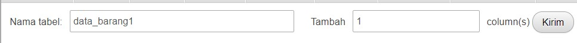
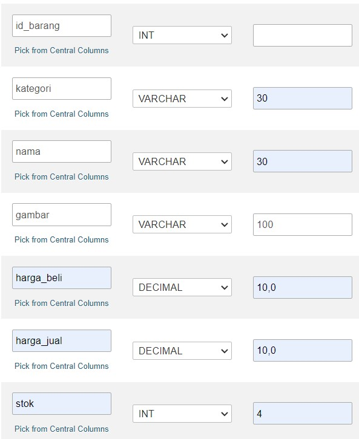

# Pemograman Web
~~~
Nama    : Dani Darmawan
NIM     : 312010154
KELAS   : TI.20.B1
~~~
# Menjalankan Web Server
Untuk menjalankan web server dari menu XAMPP Control.

# Memulai PHP
Buat folder lab7_php_dasar pada root directory web server (d:\xampp\htdocs)

Kemudia untuk mengakses direktory tersebut pada web server dengan mengakses URL: http://localhost/lab7_php_dasar/ 

# PHP Dasar
Buat file baru dengan nama php_dasar.php pada directory tersebut. Kemudian buat kode seperti berikut.
~~~
<!DOCTYPE html>
<html lang="en">
<head>
    <meta charset="UTF-8">
    <title>PHP Dasar</title>
</head>
<body>
    <h1>Belajar PHP Dasar</h1>
    <?php
        echo "Hello World";
    ?>
</body>
</html>
~~~
Kemudian untuk mengakses hasilnya melalui URL: http://localhost/lab7_php_dasar/php_dasar.php

# Variable PHP
Menambahkan variable pada program
~~~
<h2>Menggunakan Variable</h2>
    <?php
        $nim = "311910284";
        $nama = 'Andry Prasetia Perdana';
        echo "NIM : " . $nim . " ";
        echo "Nama : $nama";
    ?>
~~~

# Predefine Variable $_GET
~~~
<h2>Predefine Variable</h2>
    <?php 
        echo 'Selamat Datang ' . $_GET['nama'];
    ?>
~~~
Untuk mengaksesnya gunakan URL: http://localhost/lab7_php_dasar/latihan2.php?nama=Dani
 

# Membuat Form Input
~~~
<h2>Form Input</h2>
    <form method="post">
        <label>Nama: </label>
        <input type="text" name="nama">
        <input type="submit" value="Kirim">
    </form>
    <?php 
        echo 'Selamat Datang ' . $_POST['nama'];
    ?>
~~~
 

# Operator
~~~
<h2>Operator</h2>
    <?php
        $gaji = 1000000;
        $pajak = 0.1;
        $thp = $gaji - ($gaji*$pajak);
            echo "Gaji sebelum pajak = Rp. $gaji  ";
            echo "Gaji yang dibawa pulang = Rp. $thp";
    ?>
~~~

# Kondisi IF
~~~
<h2>Kondisi IF</h2>
    <?php
        $nama_hari = date("l");
            if ($nama_hari == "Sunday") {
        echo "Minggu";
            } elseif ($nama_hari == "Monday") {
        echo "Senin";
            } else {
        echo "Selasa";
        }
    ?>
~~~

# Kondisi Switch
~~~
<h2>Kondisi Switch</h2>
    <?php
        $nama_hari = date("l");
            switch ($nama_hari) {
            case "Sunday":
        echo "Minggu";
            break;
            case "Monday":
    echo "Senin";
            break;
            case "Tuesday":
    echo "Selasa";
            break;
            default:
    echo "Sabtu";
            }
    ?>
~~~

# Perulangan for
~~~
<h2>Perulangan For</h2>
    <?php
        echo "Perulangan 1 sampai 10  ";
            for ($i=1; $i<=10; $i++) {
        echo "Perulangan ke: " . $i . ' ';
        }
        echo "Perulangan Menurun dari 10 ke 1  ";
            for ($i=10; $i>=1; $i--) {
        echo "Perulangan ke: " . $i . ' ';
        }
    ?>
~~~

# Perulangan while
~~~
<h2>Perulangan While</h2>
    <?php
        echo "Perulangan 1 sampai 10  ";
            $i=1;
            while ($i<=10) {
        echo "Perulangan ke: " . $i . ' ';
            $i++;
        }
    ?>
~~~

# Perulangan dowhile
~~~
<h2>Perulangan Dowhile</h2>
    <?php
        echo "Perulangan 1 sampai 10  ";
            $i=1;
            do {
        echo "Perulangan ke: " . $i . ' ';
            $i++;
            } while ($i<=10);
    ?>
~~~

# Pertanyaan dan Tugas
Buatlah program PHP sederhana dengan menggunakan form input yang menampilkan nama, tanggal lahir dan pekerjaan. Kemudian tampilkan outputnya dengan menghitung umur berdasarkan inputan tanggal lahir. Dan pilihan pekerjaan dengan gaji yang berbeda-beda sesuai pilihan pekerjaan.
~~~
<!DOCTYPE html>
<html lang="en">
<head>
    <meta charset="UTF-8">
    <title>PHP Dasar</title>
</head>
<body>
    <h1>Belajar PHP Dasar</h1>
    <?php
        echo "Tugas 7";
    ?>
<h2>Pertanyaan dan Tugas</h2>
    <form method="post">
            <label>Nama Lengkap: </label>
            <input type="text" name="nama">
             
            <label>Tempat Lahir: </label>
            <input type="text" name="tempat_lahir">
             
            <label>Tanggal Lahir: </label>
            <input type="date" name="tgl_lahir">
             
            <label>Alamat: </label>
            <input type="text" name="alamat">
             
            <label>Pekerjaan:
            <select name='pekerjaan'>
                <option value='Asisten Manajer'>Asisten Manajer</option>
                <option value='Manajer'>Manajer</option>
                <option value='General Manajer'>General Manajer</option>
                <option value='Direktur'>Direktur</option>
            </select>
            </label>
             
            <input type="submit" value="Kirim">
    </form>
    <h2>Output</h2>
    <?php
        echo '  Nama Lengkap : ' . $_POST['nama'];
        echo '  Tempat Lahir : ' . $_POST['tempat_lahir'];
        echo '  Alamat : ' . $_POST['alamat'];
            $tgl_lahir = @$_POST['tgl_lahir'];
            $lahir = new DateTime($tgl_lahir);
            $hari_ini = new DateTime();
            $diff = $hari_ini->diff($lahir);
        echo "  Usia : ". $diff->y ." Tahun";
        echo "  Pekerjaan : ". $_POST['pekerjaan'];
            $pekerjaan = @$_POST['pekerjaan'];
            if($pekerjaan == "Asisten Manajer"){
                echo '  Gaji : Rp. 8.000.000,-';
            }
            elseif($pekerjaan == "Manajer"){
                echo '  Gaji : Rp. .10.000.000,-';
            }
            elseif($pekerjaan == "General Manajer"){
                echo '  Gaji : Rp. 30.000.000,-';
            }
            elseif($pekerjaan == "Direktur"){
                echo '  Gaji : Rp. 100.000.000,-';
            }
    ?>
</body>
</html>
~~~

